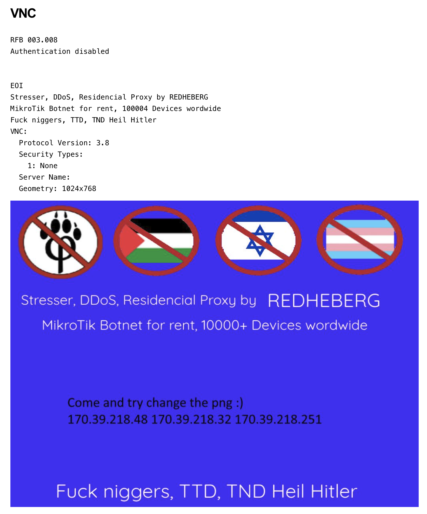

# REDHEBERG — MikroTik Botnet Threat Intelligence

> **Status: Ongoing** — Data is reliable but incomplete. This repository is updated as new indicators are identified. Community verification is welcome.

---

## Overview

**REDHEBERG** is the working name for a botnet campaign targeting MikroTik routers, identified through Shodan reconnaissance and corroborated by reporting from the Czech Republic's National Cyber and Information Security Agency (NÚKIB) and CERT.cz (VCEERT), as well as research by our partner **[Thinkst Applied Research](https://thinkst.com/)**.

The operation appears to serve two concurrent purposes:

1. **DDoS-for-hire (stresser)** — the botnet is actively advertised as a commercial DDoS and stresser service.
2. **Residential proxy network** — compromised routers are offered as residential proxy exit nodes, enabling customers to circumvent IP-based blocking for malicious or criminal purposes.

The threat actor's own defacement of compromised devices — including a VNC banner claiming **10,000+ devices worldwide** — suggests this is an established, commercially operated criminal service rather than an opportunistic campaign.

This repository shares Shodan-derived indicators of compromise (IoCs) to support the broader security community's detection and mitigation efforts.

---

## Background & Context

### Initial Discovery

Devices associated with this campaign were identified via Shodan queries. What stood out initially was a cluster of non-standard listening ports inconsistent with normal RouterOS deployments. The repeated presence of unauthenticated VNC/RFB responses and a distinctive **REDHEBERG** banner across multiple unrelated ports on the same devices formed the basis for attribution to a single campaign.

### Assessed Modus Operandi

The following analysis of the campaign's modus operandi was contributed by our partner **[Thinkst Applied Research](https://thinkst.com/)**.

The pattern across affected devices is consistent with **post-compromise infrastructure abuse**:

- Devices continue to expose their standard RouterOS management services (Winbox, SSH, HTTP/HTTPS, Telnet).
- In addition, a significant number of attacker-added listeners are present on unusual, non-standard ports.
- The unauthenticated VNC/RFB responses and repeated REDHEBERG banner across these ports are consistent with devices having been repurposed for remote access and proxying — likely as SOCKS relay nodes.
- Because the routers may be NATing or forwarding traffic to internal infrastructure, the actual targets behind these ports cannot be determined with confidence from external observation alone.

This operational profile is similar to other documented abuse-of-infrastructure and proxy botnet campaigns, including the **SocksEscort** proxy service disrupted by Europol and international partners, and the MikroTik-targeting Russian botnet documented in the *"One Mikro Typo"* research.

### Attribution & Prior Reporting

Thinkst Applied Research identified coverage of REDHEBERG from the **Czech Republic's National Cyber and Information Security Agency (NÚKIB)** and **CERT.cz (VCEERT)**, which primarily attribute campaign activity to the compromise of devices **exposing unauthenticated VNC services directly to the internet**. This aligns with the VNC/RFB responses observed across affected hosts.

### Initial Access Vector

The precise initial access vector used to compromise devices remains **unclear**. Based on Thinkst's analysis, [**CVE-2023-30799**](https://nvd.nist.gov/vuln/detail/CVE-2023-30799) — a privilege escalation vulnerability in MikroTik RouterOS that allows unauthenticated remote root access via the Winbox or HTTP interface — is a plausible candidate and should be treated as a priority for remediation regardless of confirmed attribution.

---

## Threat Actor Profile & Advertised Services

### Device Defacement

Every compromised MikroTik device observed in this campaign has been defaced. The threat actor serves a PNG image via the exposed VNC session that functions as an advertisement for their criminal services. The image contains extreme hate speech targeting multiple groups and is reproduced here solely for the purposes of threat documentation.



*The defacement image displayed via unauthenticated VNC on compromised devices. Content warning: the image contains racist, antisemitic, and transphobic slurs.*

### VNC Banner Sample

The following is a representative sample of the VNC service banner observed on compromised devices via Shodan:

```
RFB 003.008
Authentication disabled

Stresser, DDoS, Residencial Proxy by REDHEBERG
MikroTik Botnet for rent, 10000+ Devices worldwide

VNC:
  Protocol Version: 3.8
  Security Types:
    1: None
  Server Name:
  Geometry: 1024x768
```

Key observations from this banner:

- **Authentication is explicitly disabled** — the VNC service is intentionally left open, likely to allow the operator's own infrastructure to connect without credentials.
- **The service is self-described as commercial** — the phrasing "for rent" and the scale claim of 10,000+ devices indicate an established, monetised criminal operation.
- **The device scale claim** (10,000+ devices worldwide) is consistent with the breadth of ASNs and organisations observed in the Shodan data, though this figure cannot be independently verified at present.

### Advertised Capabilities

Based on the defacement content and VNC banner, REDHEBERG is actively marketed as providing:

| Service | Description |
|---|---|
| **Stresser / DDoS** | Volumetric denial-of-service attacks for hire using the botnet's aggregate bandwidth |
| **Residential Proxy** | Exit nodes via compromised routers, used to circumvent IP reputation and geo-blocking controls |

The residential proxy use case is particularly significant: traffic routed through legitimate ISP-assigned MikroTik routers carries the appearance of genuine residential or business connectivity, making it substantially harder to block than traffic from commercial VPS or data centre ranges.

### Threat Actor Indicators

- The actor uses extreme, ideologically motivated hate speech in their defacement material. This might be purposed rage-baiting.
- The defacement icons include symbols associated with opposition to furry communities, Palestinian and Israeli flags, and the transgender pride flag — alongside neo-Nazi slogans. 
- The challenge embedded in the defacement (*"Come and try change the png"*) alongside hardcoded IP addresses (`170.39.218.48`, `170.39.218.32`, `170.39.218.251`) suggests the operator actively monitors their infrastructure and is aware of researcher attention.
- The call for attention, the explicit language and icons used 

---

## Indicators of Compromise

Indicators are provided as CSV exports from Shodan and are split across three files:

| File | Description |
|---|---|
| `REDHEBERG_evolution_ASNs.csv` | Top autonomous system numbers (ASNs) associated with affected IP addresses |
| `REDHEBERG_evolutions_domains.csv` | Domain names associated with affected IP addresses |
| `REDHEBERG_evolution_organisations.csv` | Organisations associated with affected IP addresses, as recorded in Shodan |

> **Note:** These exports represent a point-in-time snapshot (2026-04-01). Infrastructure may shift. Cross-reference with live Shodan queries and other threat intelligence sources before taking action.

### Recommended Detection Approach

1. Query your asset inventory or perimeter monitoring for devices matching affected ASNs or IP ranges.
2. Search for hosts exposing RFB/VNC on non-standard ports alongside RouterOS management services.
3. Scan for the REDHEBERG banner string across listening services.
4. Prioritise remediation of any MikroTik device running a RouterOS version vulnerable to CVE-2023-30799.

---

## Mitigation Guidance

If you manage MikroTik devices, the following steps are strongly recommended:

- **Update RouterOS** to the latest stable release to remediate CVE-2023-30799 and other known vulnerabilities.
- **Disable unauthenticated VNC** and restrict VNC access to trusted management networks only.
- **Audit listening services** — any port not explicitly provisioned should be treated as suspicious.
- **Restrict management interfaces** (Winbox, SSH, HTTP) to known IP ranges using firewall rules.
- **Review firewall and NAT rules** for unexpected forwarding entries that may have been injected by an attacker.
- **Rotate all credentials** on any device suspected to have been compromised.

---

## References

- NÚKIB / CERT.cz — Reporting on REDHEBERG campaign activity *(link to be added)*
- Europol — [Disruption of the SocksEscort proxy service](https://www.europol.europa.eu) *(update with direct URL)*
- Bsides / Security Research — *One Mikro Typo: How a simple DNS misconfiguration enables malware delivery by a Russian botnet* *(link to be added)*
- NVD — [CVE-2023-30799](https://nvd.nist.gov/vuln/detail/CVE-2023-30799)

---

## Data Sources & Methodology

All IoC data was collected via **[Shodan.io](https://www.shodan.io)** using targeted queries for the REDHEBERG banner string and associated service fingerprints. No active exploitation or intrusive scanning was performed. Data reflects passive observation of publicly reachable internet-facing services.

---

## About

This research was conducted by **[wicked.design GmbH](https://wicked.design)**, a cybersecurity firm based in Zürich, Switzerland, operating a 24×7 Security Operations Centre (SOC) with a focus on threat intelligence, managed detection and response, and security services for European organisations.

The modus operandi analysis and corroborating threat intelligence were contributed by **[Thinkst Applied Research](https://thinkst.com/)**, our partner for Cyber Deception Services (CDS). Thinkst are the creators of Canarytokens and the Thinkst Canary platform, and are a trusted source of applied security research.

---

## Licence

This repository is licensed under the **GNU General Public License v3.0**.  
You are free to use, share, and adapt this data under the terms of the GPL v3.0, provided that derivative works are distributed under the same licence.

---

## Disclaimer

The information in this repository is provided in good faith for defensive and research purposes only. wicked.design GmbH makes no warranties as to the completeness or accuracy of the data. This repository does not constitute legal advice. Use of this information is at your own risk.
